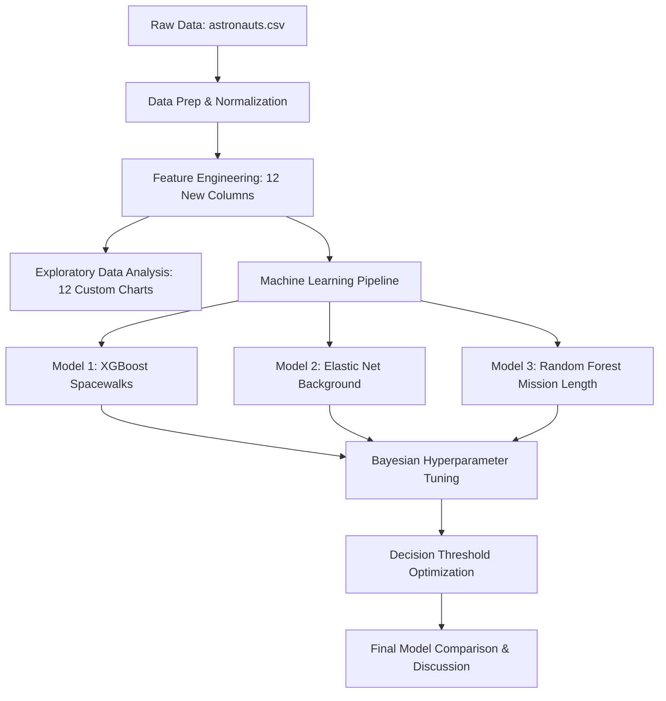
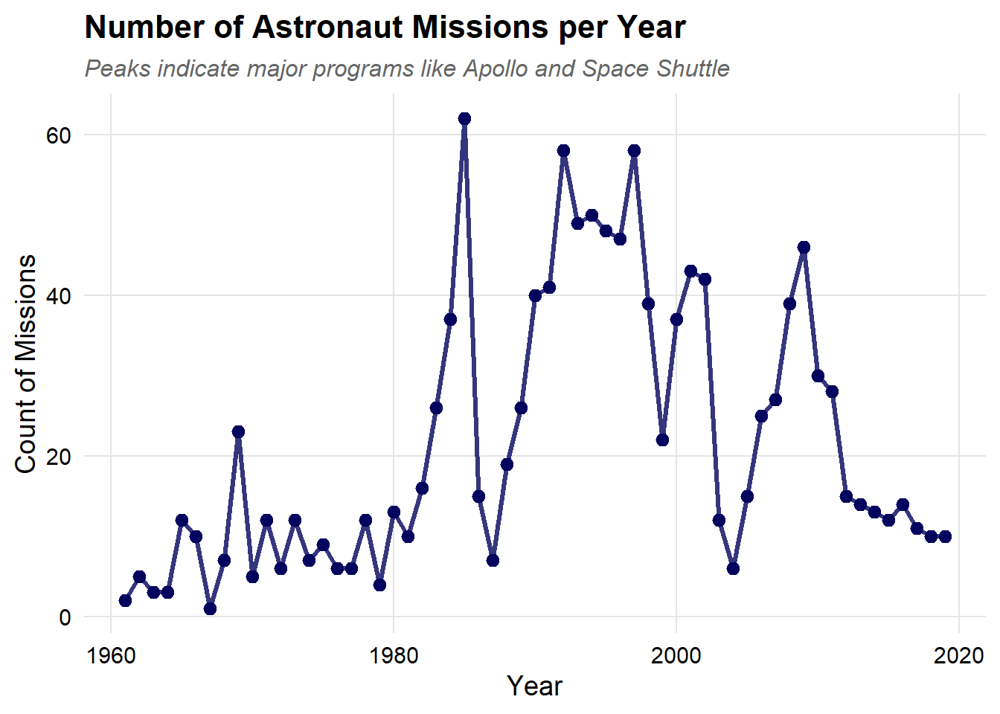
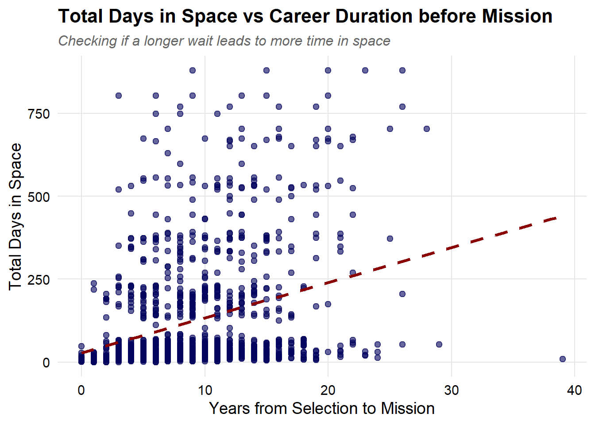
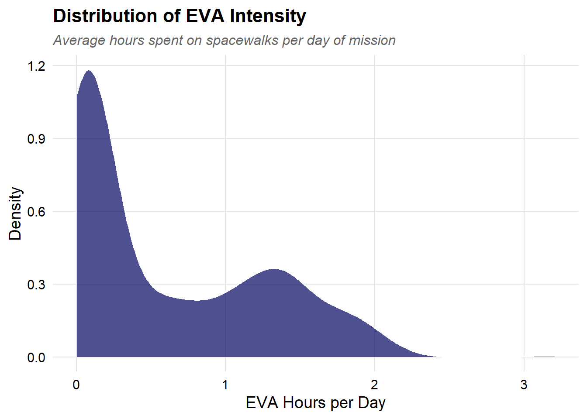
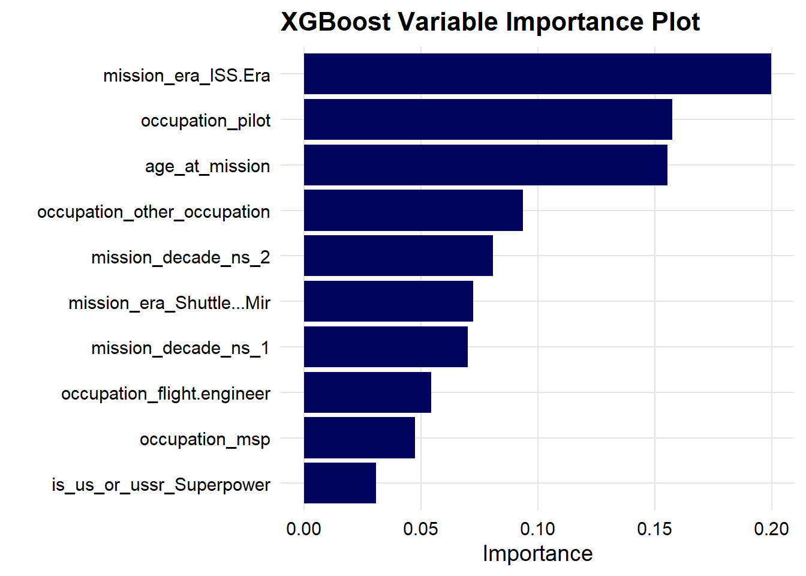
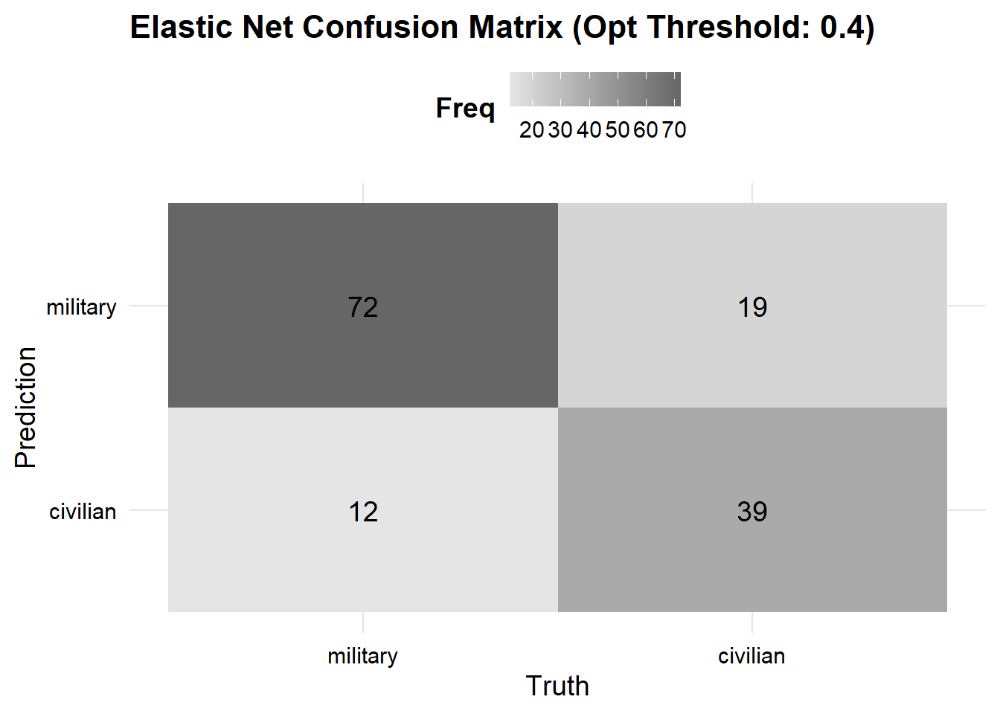
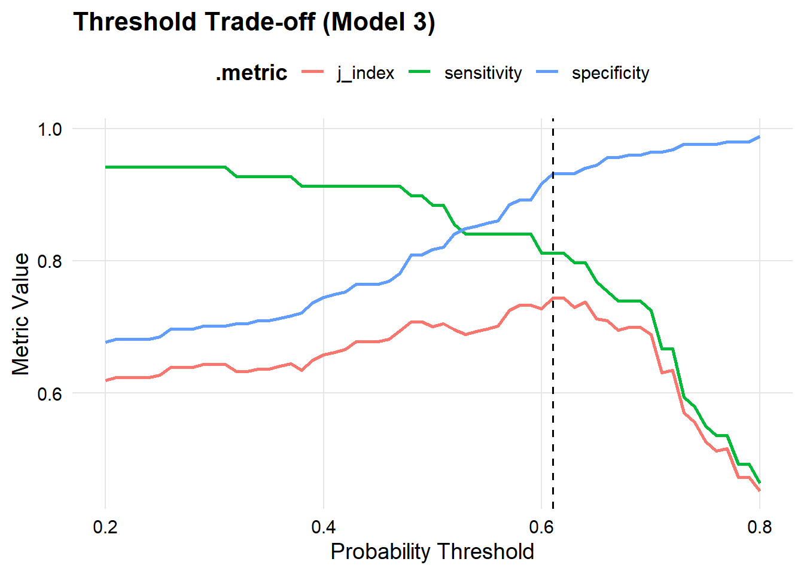

# Human Spaceflight Analysis & Predictive Modeling

This repository contains an end-to-end data analysis and machine learning workflow on the historical **Astronauts dataset** (sourced from TidyTuesday: https://github.com/rfordatascience/tidytuesday/blob/main/data/2020/2020-07-14/readme.md).

The project is fully developed in `astronaut_database.Rmd` and compiled into the self-contained HTML report `astronaut_database.html`.

---

## Project Workflow & Architecture

### 1. Data Cleaning & Preparation
- **Offline Caching**: Automatically loads `data/astronauts.csv` if present, otherwise downloads it directly from TidyTuesday and stores a local copy.
- **Categorical Normalization**: Converts text columns to lowercase to prevent duplicates (e.g., standardizing `"pilot"` vs `"Pilot"`), and handles missing records by imputing `"Unknown"`.
- **Text Cleaning via Regex**: Parses occupational titles, extracting specific roles from nested entries like `"other (space tourist)"` using regular expressions.
- **Factor Conversion**: Formats nominal features into factors for proper modeling execution.

### 2. Feature Engineering (12 New Variables)
We enriched the dataset by creating exactly 12 derived columns:
1. `age_at_selection`: Age when selected.
2. `age_at_mission`: Age during the launch.
3. `decade_of_mission`: Mission grouping by decade.
4. `career_duration`: Years from selection to mission.
5. `mission_duration_days`: Mission length in days.
6. `total_days_in_space`: Cumulative spaceflight hours in days.
7. `is_us_or_ussr`: Indicator for superpower agencies (detecting mixed missions via regex).
8. `has_eva`: Binary indicator of whether the mission included a spacewalk.
9. `experience_level`: Classifying crews into `Rookie` (first flight) vs `Veteran`.
10. `eva_percentage`: Proportion of mission duration spent on spacewalks.
11. `mission_era`: Historical spaceflight era (`Space Race`, `Shuttle & Mir`, `ISS Era`).
12. `eva_intensity_hrs_per_day`: Spacewalk workload normalized by flight length.

### 3. Exploratory Data Analysis (EDA)
The EDA features **12 premium charts** built with a custom global theme that supports both **Light Mode** and **Dark Mode** (configured dynamically at the top of the report via `use_dark_mode`). 

#### Key Visualizations:
* **Missions per Year**: Line plot showing the annual number of human spaceflight missions, highlighting historical milestones.
  
  

* **Career Duration vs. Space Time**: Comparing the wait time (years from selection to mission) against cumulative days in space.
  
  

* **EVA Intensity Distribution**: Density plot displaying the average hours spent on extravehicular activities normalized by mission duration.
  
  

---

## Machine Learning Pipeline (Tidymodels)

We developed three classification models designed to prevent **Data Leakage** (look-ahead bias) and eliminate **Trivial Predictors**:

### Model 1: Spacewalk Prediction (`has_eva`) using XGBoost
- **Objective**: Predict whether a space mission includes a spacewalk based on crew demographics and pre-launch features.
- **Anti-Bias Measure**: Excluded raw year and mission hours (which behave as deterministic indicators of modern flights).
- **Imbalance Correction**: Leveraged XGBoost's native `scale_pos_weight` engine parameter to avoid synthetic probability distortions.
- **Tuning**: Bayesian Optimization on `trees`, `tree_depth`, `learn_rate`, `min_n`, `loss_reduction`, and `sample_size`.
- **Variable Importance**: Temporal era and decade are the main drivers of spacewalk probability.

  

### Model 2: Astronaut Background (`military_civilian`) using Elastic Net
- **Objective**: Predict if an astronaut has a military or civilian background based on characteristics known at selection.
- **Anti-Bias Measure**: Removed future cumulative space/EVA hours to prevent look-ahead bias (data leakage).
- **Imbalance Correction**: Applied case weights (`case_wts`) calculated via inverse class frequencies directly to the workflow.
- **Tuning**: Bayesian Optimization on `penalty` (regularization strength) and `mixture` (L1/L2 ratio).
- **Variable Importance**: Selection era (early Space Race vs ISS) and Soviet/Russian nationalities are highly predictive of a military background.

  

### Model 3: Long-Duration Mission Prediction (`is_long_duration`) using Random Forest
- **Objective**: Forecast if a scheduled mission will last $\ge 30$ days.
- **Anti-Bias Measure**: Excluded target space station type (`station_type`) to avoid a trivial lookup table (ISS/Mir stays are always long, while Shuttle flights are short).
- **Imbalance Correction**: Handled class imbalance using case weights within the tidymodels workflow.
- **Tuning**: Bayesian Optimization on `mtry` and `min_n` with 500 trees.
- **Variable Importance**: The flight era and nationality group dominate the model, reflecting historical shifts in flight profiles.

  

---

## Final Performance Comparison

The final model evaluation on test sets (using optimized probability thresholds for minority classes) is summarized in the table below:

| Model | Accuracy | ROC AUC | Brier Score |
| :--- | :---: | :---: | :---: |
| **Model 1: XGBoost (`has_eva`)** | ~0.760 | ~0.835 | ~0.165 |
| **Model 2: Elastic Net (`military_civilian`)** | ~0.701 | ~0.768 | ~0.203 |
| **Model 3: Random Forest (`is_long_duration`)** | ~0.825 | ~0.903 | ~0.121 |

*Note: Brier scores close to 0 indicate extremely well-calibrated probability predictions.*

---

## How to Run the Project

1. **Prerequisites**: Ensure you have R and RStudio installed.
2. **Compile the Report**: Open `astronaut_database.Rmd` and click the **Knit** button in RStudio (or run `rmarkdown::render("Project/astronaut_database.Rmd")` in R).
   * *Note: You do not need to install the required libraries manually. The setup chunk at the beginning of the file automatically checks for missing packages and installs them for you.*
3. **Light/Dark Theme Toggle**: Change the variable `use_dark_mode <- FALSE` to `TRUE` in the `custom-theme` R chunk to compile the entire report and all its plots in Dark Mode.

